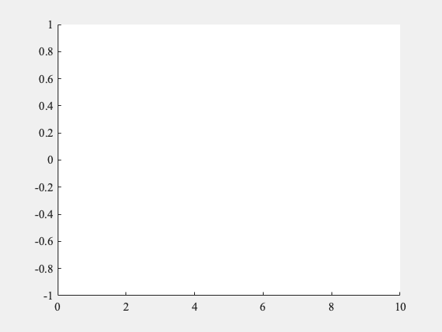

# movieExportについて
動画を生成する関数です。main.mを実行してください。
movieExport.mに動画を生成する関数を定義しています。

# 参考
[MATLABによるアニメーション作成](https://qiita.com/tose2125/items/03d9ce40b1b6bde7d36d)

[[matlab] 関数コメントの書き方](https://qiita.com/kenichi-hamaguchi/items/970f06b27873b4164d6a)